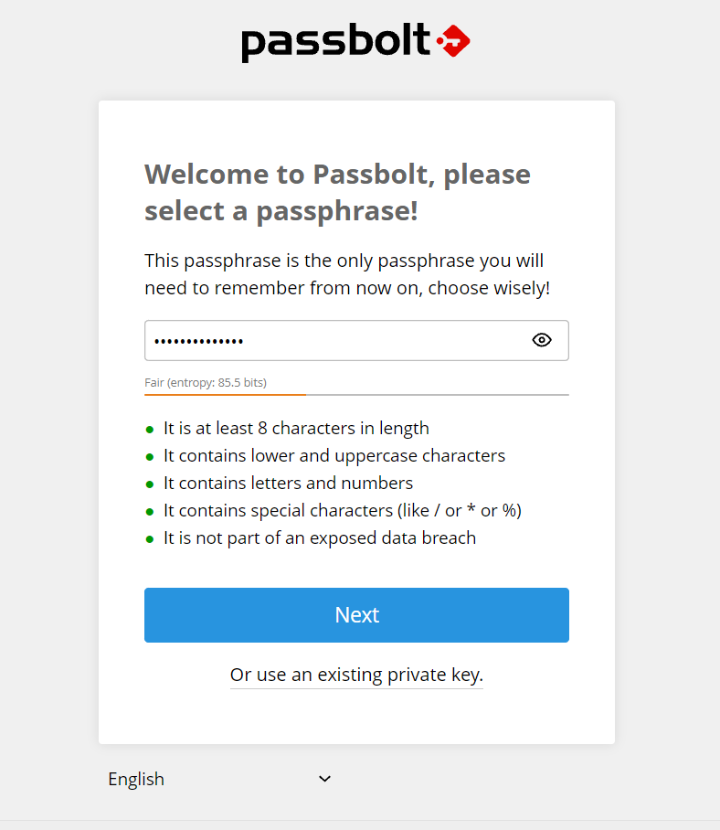

# Passbolt - Open Source Password Manager
Passbolt là một trình quản lý mật khẩu miễn phí và mã nguồn mở cho phép các thành viên trong nhóm lưu trữ và chia sẻ thông tin đăng nhập một cách an toàn.

Ví dụ như mật khẩu wifi của văn phòng, mật khẩu quản trị của một router hoặc mật khẩu tài khoản truyền thông xã hội của tổ chức của bạn, tất cả đều có thể được bảo mật bằng cách sử dụng passbolt.


## Passbolt Features
- Passbolt là một công cụ quản lý mật khẩu miễn phí và mã nguồn mở.

- Mật khẩu được mã hóa bằng OpenPGP, một tiêu chuẩn mật mã đã được sử dụng rộng rãi phổ biến nhất.

- Có sẵn các tiện ích mở rộng trình duyệt cho Firefox, Google Chrome, Microsoft Edge và Brave Browser.

- Ứng dụng di động có sẵn cho iOS và Android.

- Dễ dàng chia sẻ thông tin đăng nhập với đội nhóm mà không ảnh hưởng đến bảo mật.

- Giao diện đơn giản, thân thiện với người dùng.

- Có thể nhập và xuất mật khẩu. Bạn có thể xuất mật khẩu của mình sang định dạng tệp .kdbx hoặc .csv để sử dụng với KeepassX, LastPass hoặc 1password.

- Bạn có thể thêm thông tin đăng nhập theo cách thủ công.

## System requirements
- Quyền root

- Đã cài đặt [docker](https://github.com/LamTruong-SystemAdmin/Docker/blob/master/README.md) và [docker-compose](https://github.com/docker/compose/releases)

- Máy chủ SMTP đang hoặt động để nhận thông báo qua email

- [Dịch vụ NTP](https://help.passbolt.com/faq/hosting/set-up-ntp) đang hoạt động để tránh các sự cố xác thực GPG

- Quy tắc [Firewall](https://help.passbolt.com/faq/hosting/firewall-rules)

## Docker passbolt installation
Lên tạo 1 folder riêng cho project, tên tùy theo nhu cầu cá nhân. Trong hướng dẫn này mình sẽ tạo folder có tên: **passbolt**
### 1. Tải xuống file mẫu docker-compose.yml của passbolt
```console
wget https://download.passbolt.com/ce/docker/docker-compose-ce.yaml
wget https://github.com/passbolt/passbolt_docker/releases/latest/download/docker-compose-ce-SHA512SUM.txt
```

### 2. Đảm bảo file không bị hỏng bằng cách xác minh shasum của nó
```console
sha512sum -c docker-compose-ce-SHA512SUM.txt
```
Kết quả trả về
```console
docker-compose-ce.yaml: OK
```
### 3. Cấu hình các biến môi trường trong file docker-compose để tùy chỉnh phiên bản của bạn
- Sửa lại tên file docker-compose để khi run command sẽ tiện hơn

    ```console
    rm docker-compose-ce-SHA512SUM.txt
    mv docker-compose-ce.yaml docker-compose.yml
    ```
- Dưới đây là file template docker-compose.yaml đã config, bạn có thể tham khảo và chỉnh sửa cho phù hợp với nhu cầu cá nhân

    ```console
    version: "3.9"
    services:
    db:
        image: mariadb:10.11
        restart: unless-stopped
        environment:
        - MYSQL_RANDOM_ROOT_PASSWORD=true
        - MYSQL_DATABASE=passbolt
        - MYSQL_USER=passboltuser
        - MYSQL_PASSWORD=Passboltpassword
        volumes:
        - database_volume:/var/lib/mysql
        - /etc/localtime:/etc/localtime:ro

    passbolt:
        image: passbolt/passbolt:4.0.2-2-ce
        restart: unless-stopped
        depends_on:
        - db
        environment:
        - APP_FULL_BASE_URL=https://passbolt.b4safe.com
        - DATASOURCES_DEFAULT_HOST=db
        - DATASOURCES_DEFAULT_USERNAME=passboltuser
        - DATASOURCES_DEFAULT_PASSWORD=Passboltpassword
        - DATASOURCES_DEFAULT_DATABASE=passbolt
        - EMAIL_TRANSPORT_DEFAULT_HOST=smtp.gmail.com
        - EMAIL_TRANSPORT_DEFAULT_PORT=587
        - EMAIL_TRANSPORT_DEFAULT_USERNAME=sharefshare2022@gmail.com
        - EMAIL_TRANSPORT_DEFAULT_PASSWORD=zubjaeizhjqzsbdj
        - EMAIL_TRANSPORT_DEFAULT_TLS=true
        - EMAIL_DEFAULT_FROM=no-reply@b4safe.com
        volumes:
        - gpg_volume:/etc/passbolt/gpg
        - jwt_volume:/etc/passbolt/jwt
        - /etc/localtime:/etc/localtime:ro
        command:
        [
            "/usr/bin/wait-for.sh",
            "-t",
            "0",
            "db:3306",
            "--",
            "/docker-entrypoint.sh",
        ]
        labels:
        traefik.enable: "true"
        traefik.http.routers.passbolt-http.entrypoints: "web"
        traefik.http.routers.passbolt-http.rule: "Host(`passbolt.b4safe.com`)"
        traefik.http.routers.passbolt-http.middlewares: "SslHeader@file"
        traefik.http.routers.passbolt-https.middlewares: "SslHeader@file"
        traefik.http.routers.passbolt-https.entrypoints: "websecure"
        traefik.http.routers.passbolt-https.rule: "Host(`passbolt.b4safe.com`)"
        traefik.http.routers.passbolt-https.tls: "true"
        traefik.http.routers.passbolt-https.tls.certresolver: "letsencrypt"

    traefik:
        image: traefik:2.6
        restart: always
        ports:
        - 80:80
        - 443:443
        volumes:
        - /var/run/docker.sock:/var/run/docker.sock:ro
        - ./traefik.yaml:/traefik.yaml:ro
        - ./conf/:/etc/traefik/conf
        - ./shared/:/shared
        - /etc/localtime:/etc/localtime:ro

    volumes:
    database_volume:
    gpg_volume:
    jwt_volume:
    ```
**Bây giờ chúng ta sẽ đi vào từng services trong file docker-compose.yaml**
- Đầu tiên là **database**:

    ```console
    db:
        image: mariadb:10.11
        restart: unless-stopped
        environment:
        - MYSQL_RANDOM_ROOT_PASSWORD=true
        - MYSQL_DATABASE=passbolt
        - MYSQL_USER=passboltuser
        - MYSQL_PASSWORD=Passboltpassword
        volumes:
        - database_volume:/var/lib/mysql
        - /etc/localtime:/etc/localtime:ro
    ```
    Thay đổi các environment MYSQL_DATABASE, MYSQL_USER, MYSQL_PASSWORD

- Service thứ 2 là **passbolt**:
    ```console
    passbolt:
        image: passbolt/passbolt:4.0.2-2-ce
        restart: unless-stopped
        depends_on:
        - db
        environment:
        - APP_FULL_BASE_URL=https://passbolt.b4safe.com
        - DATASOURCES_DEFAULT_HOST=db
        - DATASOURCES_DEFAULT_USERNAME=passboltuser
        - DATASOURCES_DEFAULT_PASSWORD=Passboltpassword
        - DATASOURCES_DEFAULT_DATABASE=passbolt
        - EMAIL_TRANSPORT_DEFAULT_HOST=smtp.gmail.com
        - EMAIL_TRANSPORT_DEFAULT_PORT=587
        - EMAIL_TRANSPORT_DEFAULT_USERNAME=sharefshare2022@gmail.com
        - EMAIL_TRANSPORT_DEFAULT_PASSWORD=zubjaeizhjqzsbdj
        - EMAIL_TRANSPORT_DEFAULT_TLS=true
        - EMAIL_DEFAULT_FROM=sharefshare2022@gmail.com
        volumes:
        - gpg_volume:/etc/passbolt/gpg
        - jwt_volume:/etc/passbolt/jwt
        - /etc/localtime:/etc/localtime:ro
        command:
        [
            "/usr/bin/wait-for.sh",
            "-t",
            "0",
            "db:3306",
            "--",
            "/docker-entrypoint.sh",
        ]
        labels:
        traefik.enable: "true"
        traefik.http.routers.passbolt-http.entrypoints: "web"
        traefik.http.routers.passbolt-http.rule: "Host(`passbolt.b4safe.com`)"
        traefik.http.routers.passbolt-http.middlewares: "SslHeader@file"
        traefik.http.routers.passbolt-https.middlewares: "SslHeader@file"
        traefik.http.routers.passbolt-https.entrypoints: "websecure"
        traefik.http.routers.passbolt-https.rule: "Host(`passbolt.b4safe.com`)"
        traefik.http.routers.passbolt-https.tls: "true"
        traefik.http.routers.passbolt-https.tls.certresolver: "letsencrypt"
    ```
    **Trong đó:**
    - image: passbolt/passbolt:4.0.2-2-ce (Nên dụng version -ce mới nhất để được hỗ trợ MFA. Chi tiết [tại đây](https://hub.docker.com/r/passbolt/passbolt/tags))
    - APP_FULL_BASE_URL: Sử dụng domain của bạn, đã có bản ghi A trỏ đến server
    - Các environment DATASOURCES_DEFAULT_USERNAME, DATASOURCES_DEFAULT_PASSWORD, DATASOURCES_DEFAULT_DATABASE sử dụng lại từ service db đầu tiên
    - Các environment EMAIL_TRANSPORT_DEFAULT (Tìm hiểu chi tiết [tại đây](https://help.passbolt.com/configure/email/setup)):
      - HOST: Trong hướng dẫn này sử dụng mail server của google
      - PORT: mail google sử dụng port 587
      - USERNAME: sử dụng account mail của google
      - PASSWORD: Tạo password ứng dụng để sử dụng giúp tăng tính bảo mật, không sử dụng trực tiếp password chính của mail (Tham khảo [tại đây](https://123host.vn/tailieu/kb/hosting/huong-dan-tao-mat-khau-ung-dung-cho-gmail.html))
      - TLS: đặt thành true
    - EMAIL_DEFAULT_FROM: Các server mail public như google sẽ hạn chế các email có dạng you@localhost theo mặc định.
    - Phần về **labels traefik** sẽ được giải thích ở service dưới.

- Service cuối cùng là **traefik**:
    ```console
    traefik:
        image: traefik:2.6
        restart: always
        ports:
        - 80:80
        - 443:443
        volumes:
        - /var/run/docker.sock:/var/run/docker.sock:ro
        - ./traefik.yaml:/traefik.yaml:ro
        - ./conf/:/etc/traefik/conf
        - ./shared/:/shared
        - /etc/localtime:/etc/localtime:ro
    ```
    - Chi tiết cách cấu hình tham khảo [tại đây](https://help.passbolt.com/configure/https/ce/docker/auto.html). Sử dụng [traefik](https://traefik.io/) để làm load balancer và reverse-proxy, cấp SSL cho passbolt, expose container passbolt.
    - Có thể thấy traefik cũng cần sử dụng các tệp cấu hình riêng để chạy cho passbolt. Tạo **traefik.yaml** cùng với nơi chứa file docker-compose và folder **conf** gồm 2 file **headers.yaml** và **tls.yaml**. Chúng có tác dụng lưu trữ certificate và 1 số cấu hình bổ sung.
      - **traefik.yaml**:
        ```console
        global:
        sendAnonymousUsage: false
        log:
        level: INFO
        format: common
        providers:
        docker:
            endpoint: 'unix:///var/run/docker.sock'
            watch: true
            exposedByDefault: false
            swarmMode: false
        file:
            directory: /etc/traefik/conf/
            watch: true
        api:
        dashboard: false
        debug: false
        insecure: false
        entryPoints:
        web:
            address: ':80'
            http:
            redirections:
                entryPoint:
                to: websecure
                scheme: https
                permanent: true
        websecure:
            address: ':443'
        certificatesResolvers:
        letsencrypt:
            acme:
            email: sharefshare2022@gmail.com
            storage: /shared/acme.json
            caServer: 'https://acme-v02.api.letsencrypt.org/directory'
            keyType: EC256
            httpChallenge:
                entryPoint: web
            tlsChallenge: {}
        ```
        Chú ý cần chỉnh sửa 2 dòng sau:
        
        exposedByDefault: false (tham khảo [tại đây đoạn 11:50](https://youtu.be/cEDXeYStfP4))

        email: sharefshare2022@gmail.com
      - **headers.yaml**
        ```console
        http:
        middlewares:
            SslHeader:
            headers:
                FrameDeny: true
                AccessControlAllowMethods: 'GET,OPTIONS,PUT'
                AccessControlAllowOriginList:
                - origin-list-or-null
                AccessControlMaxAge: 100
                AddVaryHeader: true
                BrowserXssFilter: true
                ContentTypeNosniff: true
                ForceSTSHeader: true
                STSIncludeSubdomains: true
                STSPreload: true
                ContentSecurityPolicy: default-src 'self' 'unsafe-inline'
                CustomFrameOptionsValue: SAMEORIGIN
                ReferrerPolicy: same-origin
                PermissionsPolicy: vibrate 'self'
                STSSeconds: 315360000
        ```
      - **tls.yaml**:
        ```console
        tls:
        options:
            default:
            minVersion: VersionTLS12
            sniStrict: true
            curvePreferences:
                - CurveP521
                - CurveP384
            cipherSuites:
                - TLS_ECDHE_ECDSA_WITH_AES_128_GCM_SHA256
                - TLS_ECDHE_ECDSA_WITH_AES_256_GCM_SHA384
                - TLS_ECDHE_ECDSA_WITH_CHACHA20_POLY1305_SHA256
        ```
    - Tiếp đến là xử lý passbolt với Traefik. Để traefik chuyển hướng các yêu cầu sang passbolt. **Phần này giải thích cho đoạn cấu hình traefik trong labels ở đoạn cuối phần service passbolt**
        ```console
            labels:
            traefik.enable: "true"
            traefik.http.routers.passbolt-http.entrypoints: "web"
            traefik.http.routers.passbolt-http.rule: "Host(`passbolt.b4safe.com`)"
            traefik.http.routers.passbolt-http.middlewares: "SslHeader@file"
            traefik.http.routers.passbolt-https.middlewares: "SslHeader@file"
            traefik.http.routers.passbolt-https.entrypoints: "websecure"
            traefik.http.routers.passbolt-https.rule: "Host(`passbolt.b4safe.com`)"
            traefik.http.routers.passbolt-https.tls: "true"
            traefik.http.routers.passbolt-https.tls.certresolver: "letsencrypt"
        ```
        Chú ý thay đổi 2 dòng sau bằng domain thật của bạn:
        - **traefik.http.routers.passbolt-http.middlewares** và **traefik.http.routers.passbolt-https.rule**

### 4. Khởi động containers
Sử dụng lệnh sau để chạy ngầm containers
```console
docker-compose up -d
```
Nếu passbolt không hoạt động hoặc xảy ra lỗi thì bạn cần chạy lệnh sau
```console
docker-compose up
```
```console
root@passbolt-docker:~# docker ps
CONTAINER ID   IMAGE                          COMMAND                  CREATED          STATUS          PORTS                                                                      NAMES
bb796c109e27   passbolt/passbolt:4.0.2-2-ce   "/usr/bin/wait-for.s…"   59 seconds ago   Up 57 seconds   80/tcp, 443/tcp                                                            passbolt-passbolt-1
12a423d1356c   mariadb:10.11                  "docker-entrypoint.s…"   59 seconds ago   Up 58 seconds   3306/tcp                                                                   passbolt-db-1
a3d9654f13b2   traefik:2.6                    "/entrypoint.sh trae…"   59 seconds ago   Up 58 seconds   0.0.0.0:80->80/tcp, :::80->80/tcp, 0.0.0.0:443->443/tcp, :::443->443/tcp   passbolt-traefik-1
```

### 5. Tạo người dùng admin đầu tiên
```console
docker-compose exec passbolt su -m -c "/usr/share/php/passbolt/bin/cake passbolt register_user -u sharefshare2022@gmail.com -f lamtruong -l nguyen -r admin" -s /bin/sh www-data
```
**Chú ý**:
- Sử dụng email chính xác để nhận thư từ passbolt
- Thay đổi tên sao cho phù hợp với bạn
- Phần **-r admin** chính là role của bạn

Kết quả sẽ hiển thị sẽ có dạng như sau:
```console
     ____                  __          ____
    / __ \____  _____ ____/ /_  ____  / / /_
   / /_/ / __ `/ ___/ ___/ __ \/ __ \/ / __/
  / ____/ /_/ (__  |__  ) /_/ / /_/ / / /
 /_/    \__,_/____/____/_.___/\____/_/\__/

 Open source password manager for teams
-------------------------------------------------------------------------------
User saved successfully.
To start registration follow the link provided in your mailbox or here:
https://passbolt.b4safe.com/setup/install/36d36d63-52fd-4919-92f9-3520b23bdddb/a56834a9-2a71-4ebc-b7d6-4e5cfb46e4aa
```
Thư sẽ được gửi đến đúng mail mà bạn đã đăng kí. Hoặc có thể truy cập trực tiếp từ URL hiển thị trên terminal.

### 6. Đăng nhập và sử dụng cơ bản
- Download extension và ghim vào browser

    

    

- Tạo passphrase và download recovery-kit (private key PGP)

    

- Setup security token

    

- Test đăng nhập vào 1 website bất kì

    Creare a new credential

    

    Nhập thông tin và save lại

    

    Trên trang chủ passbolt đã có thông tin account bạn vừa nhập

    

    Khi sử dụng Gapo bạn chỉ cần click vào icon passbolt và sử dụng

    

- Tạo 1 password bất kì

    

    Có thể sử dụng chức năng tự generator của passbolt
    
     

    Nhưng ở đây mình sẽ tự nhập vì account đã có sẵn :))

    **Gợi ý**: Bạn có thể lưu private key hoặc các loại key vào phần Description
    
    

- Share cho người dùng khác (chuột phải vào credential muốn share, có thể cấp quyền cho người được share quyền read, update,...theo ý muốn)

    

### => Còn rất nhiều tính năng khác sẽ được update trong thời gian tới:
- Tạo user, group, chia roles
- Enable MFA (TOTP, Yubikey, Duo)
- Tạo folder cho từng loại công việc và tính năng theo ý muốn
- Setup trên mobile
- ...